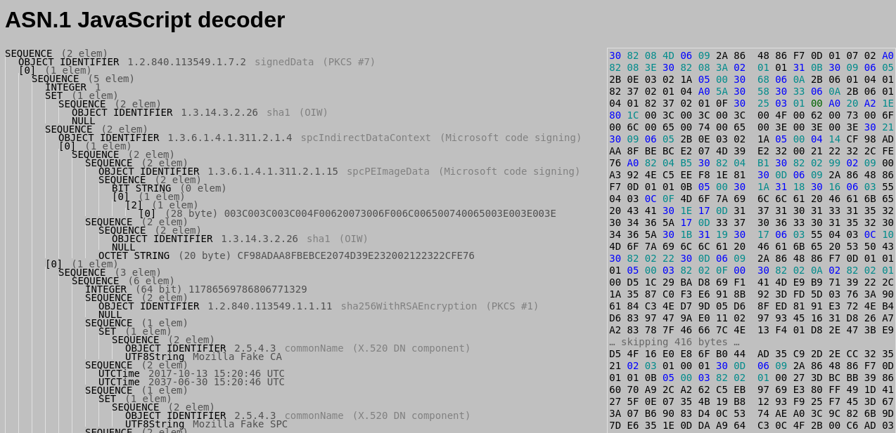
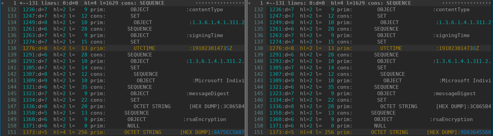

# winsign

Signing Windows files in automation

Note:
I want to achive 3 things with this demo:
1. Introduce the basic ideas with windows signatures
2. Introduce the code in winsign
3. Show some tools I found useful when working on this code

---?image=assets/img/willian-justen-de-vasconcellos-rM9V6BjNaKM-unsplash.jpg

@snap[text-white]
Signing
It's not black magic!
@snapend

@snap[south]
<a style="background-color:black;color:white;text-decoration:none;padding:4px 6px;font-family:-apple-system, BlinkMacSystemFont, &quot;San Francisco&quot;, &quot;Helvetica Neue&quot;, Helvetica, Ubuntu, Roboto, Noto, &quot;Segoe UI&quot;, Arial, sans-serif;font-size:12px;font-weight:bold;line-height:1.2;display:inline-block;border-radius:3px" href="https://unsplash.com/@willianjusten?utm_medium=referral&amp;utm_campaign=photographer-credit&amp;utm_content=creditBadge" target="_blank" rel="noopener noreferrer" title="Download free do whatever you want high-resolution photos from Willian Justen de Vasconcellos"><span style="display:inline-block;padding:2px 3px"><svg xmlns="http://www.w3.org/2000/svg" style="height:12px;width:auto;position:relative;vertical-align:middle;top:-2px;fill:white" viewBox="0 0 32 32"><title>unsplash-logo</title><path d="M10 9V0h12v9H10zm12 5h10v18H0V14h10v9h12v-9z"></path></svg></span><span style="display:inline-block;padding:2px 3px">Willian Justen de Vasconcellos</span></a>
@snapend

Note:
With the right tools and some persistence, it is possible to understand how these things
work.

---
## PE File Format

[](https://upload.wikimedia.org/wikipedia/commons/1/1b/Portable_Executable_32_bit_Structure_in_SVG_fixed.svg)

Note:
We're after the CertificateTable, in the so-called "optional header" section. This
contains information about where signatures of the file are located, and how many there
are.

To get there, we need to understand the structure of the different fields above are.
Note that the offsets of some of these sections are different between 32-bit and 64-bit
binaries.

---
### pefile.py

@snap[text-05]
```python
# From https://github.com/mozilla-releng/winsign/blob/master/src/winsign/pefile.py
pe_header = Struct(
    "offset" / Tell,
    "magic" / Enum(Int16ul, PE32=0x10B, PE32PLUS=0x20B),
    Seek(this.offset + 64),
    "checksum_offset" / Tell,
    "checksum" / Int32ul,
    Seek(lambda ctx: ctx.offset + (92 if ctx.magic == "PE32" else 108)),
    "nrvasizes" / Int32ul,
    Seek(lambda ctx: ctx.offset + (128 if ctx.magic == "PE32" else 144)),
    "certtable_info" / If(this.nrvasizes >= 5, Tell),
    "certtable_offset" / If(this.nrvasizes >= 5, Int32ul),
    "certtable_size" / If(this.nrvasizes >= 5, Int32ul),
)

...

pefile = Struct(
    "dos_stub" / dos_stub,
    Seek(this.dos_stub.pe_offset),
    "coff_header" / coff_header,
    "optional_header" / pe_header,
    Seek(this.optional_header.offset + this.coff_header.optionalheader_size),
    "sections" / Array(this.coff_header.nsections, section),
    If(
        this.optional_header.certtable_offset,
        Seek(this.optional_header.certtable_offset),
    ),
    "certificates"
    / If(this.optional_header.certtable_offset, GreedyRange(certificate)),
)
```
@snapend

Note:
This code is using the `construct` module to specify file formats. Working from the
bottom, we see how a PE file is defined.

The / operator is how `construct` specifies field names and types.

`this` is a special object that refers to the current context when parsing the file.

The Tell type lets us add names to specific locations in the file that we can refer back
to later.

To get the list of certificates (signatures), we can see that we've seeked to the `certtable_offset`
location defined in the optional header.

---
### Signature basics

Signatures in Windows files contain PKCS7 SignedData blobs, serialized using ASN.1 DER encoding.

@snap[text-05]
```python
# From https://github.com/etingof/pyasn1-modules/blob/master/pyasn1_modules/rfc2315.py#L269

class SignedData(univ.Sequence):
    componentType = namedtype.NamedTypes(
        namedtype.NamedType('version', Version()),
        namedtype.OptionalNamedType('digestAlgorithms', DigestAlgorithmIdentifiers()),
        namedtype.NamedType('contentInfo', ContentInfo()),
        namedtype.OptionalNamedType('certificates', ExtendedCertificatesAndCertificates().subtype(
            implicitTag=tag.Tag(tag.tagClassContext, tag.tagFormatConstructed, 0))),
        namedtype.OptionalNamedType('crls', CertificateRevocationLists().subtype(
            implicitTag=tag.Tag(tag.tagClassContext, tag.tagFormatConstructed, 1))),
        namedtype.OptionalNamedType('signerInfos', SignerInfos())
    )
```
@snapend

Note:
The signatures in the PE certificate table are PKCS7 SignedData blobs, prefixed by some
type and size information.

signerInfos are where the individual signatures are contained certificates lists what
public certificates have been used to sign

ASN.1 is a structured object encoding. It can specify all sorts of data, the types of
which are normally indicated by Object IDs (OIDs).

DER is a particular encoding format that specifies how an ASN.1 object should be
serialized as a sequence of bytes.

---
### SignerInfo

@snap[text-05]
```python
# From https://github.com/etingof/pyasn1-modules/blob/master/pyasn1_modules/rfc2315.py#L222
class SignerInfo(univ.Sequence):
    componentType = namedtype.NamedTypes(
        namedtype.NamedType('version', Version()),
        namedtype.NamedType('issuerAndSerialNumber', IssuerAndSerialNumber()),
        namedtype.NamedType('digestAlgorithm', DigestAlgorithmIdentifier()),
        namedtype.OptionalNamedType('authenticatedAttributes', Attributes().subtype(
            implicitTag=tag.Tag(tag.tagClassContext, tag.tagFormatConstructed, 0))),
        namedtype.NamedType('digestEncryptionAlgorithm', DigestEncryptionAlgorithmIdentifier()),
        namedtype.NamedType('encryptedDigest', EncryptedDigest()),
        namedtype.OptionalNamedType('unauthenticatedAttributes', Attributes().subtype(
            implicitTag=tag.Tag(tag.tagClassContext, tag.tagFormatConstructed, 1)))
    )
```
@snapend

Note:
digestAlgorithm is where we switch between sha1/sha256

authenticatedAttributes is like an ordered dictionary of things that get signed.
It contains elements such as the hash of the content being signed. See the contentInfo
block in the SignedData object.

encryptedDigest is where the actual signature is stored

unauthenticatedAttributes is like a dictionary of things that don't get
signed. Timestamp counter signatures go into this section.

---
For a Windows file, the authenticated attributes look like:

```python
{"contentType": id_spcIndirectDataContext,
 "signingTime": timestamp,
 "spcStatementType": [id_individualCodeSigning],
 # Optional:
 "spcSpOpusInfo": {"programName": "Firefox", "url": "https://mozilla.com"},
 "messageDigest": spcDigest,
}
```

Note:
The spcDigest is a hash of the SPC object, which basically contains just the
authenticode digest.

In turn, the authenticode digest is a hash of the file contents, excluding certain sections like
the certificates and the checksum.

The authenticated attributes are encoded into a DER string, and then hashed. This is what
is ultimately signed with the private key.

---
### MSI file basics

I don't know :(

This is why I let `osslsigncode` do the heavy lifting.

Note:
The signatures themselves are in the same format. However, I don't know how to manipulate
MSI files like I do PE files.

---
## Signing flow

@snap[text-07]
Right now:
1. Use `osslsigncode` to generate and extract a dummy signature for the file.
2. Use `winsign.asn1.resign` to add our real signing certificates to the signature, and to get the signature signed by autograph.
3. Optionally add timestamp counter signatures.
4. Use `osslsigncode` to attach the real signature to the file.

This flow is implemented in [`winsign.sign.sign_file`](https://github.com/mozilla-releng/winsign/blob/master/src/winsign/sign.py#L48)
@snapend

--- 
## Tools

[`osslsigncode`](https://github.com/theuni/osslsigncode)

Note:
One of the reasons I wanted to write a pure python implementation of signing was that
osslsigncode is (was?) unmaintained. It was becoming increasingly hard to build on
different operating systems.

The different versions you can find don't all implement the same features, e.g.
attaching or extracting signatures.

---
http://www.lapo.it/asn1js/



---
`vimdiff` + `openssl asn1parse`

@snap[text-05]
```shell
osslsigncode sign -certs tests/data/cert.pem -key tests/data/privkey.pem -in tests/data/unsigned.exe -out signed1.exe
osslsigncode sign -certs tests/data/cert.pem -key tests/data/privkey.pem -in tests/data/unsigned.exe -out signed2.exe
osslsigncode extract-signature -pem -in signed1.exe -out sig1.pem
osslsigncode extract-signature -pem -in signed2.exe -out sig2.pem
vimdiff =(openssl asn1parse -i -in sig1.pem) =(openssl asn1parse -i -in sig2.pem)
```
@snapend
---
@snap[span-100]

@snapend
